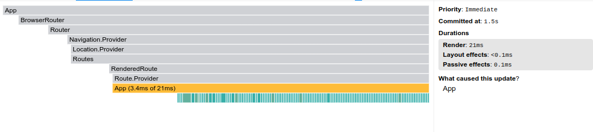
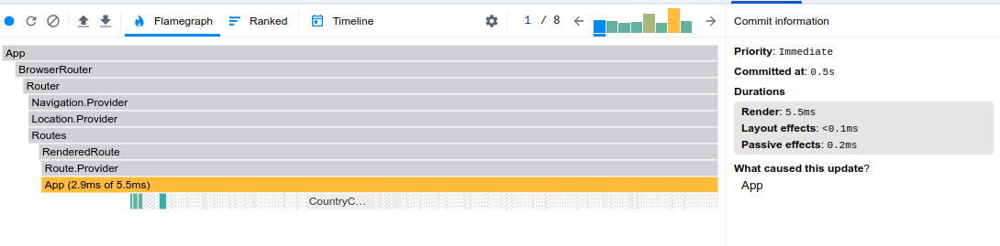

# React Performance

## Application Requirements

- Fetch and Display Data
  Fetch country data from the REST Countries API.
  Display a list of countries, including their name, population, region, and flag.
- Add Filtering and Sorting
  Filter: Allow users to filter countries by region using a dropdown menu.
  Search: Add a search bar for users to search countries by name.
  Sort: Include an option to sort countries by population or name (ascending/descending).
- Optimize the App for Performance (mind the Performance Profiling Task details)
  useMemo: Use useMemo to memoize the filtered, searched, and sorted list of countries.
  useCallback: Use useCallback to memoize event handler functions for filtering, searching, and sorting.
  React.memo: Wrap components like individual country cards in React.memo to prevent unnecessary re-renders.
  key: Ensure proper use of key props for lists to avoid reconciliation issues.
- Highlight countries visited by the user (you can store visited countries in the local storage).

## Profiling the application performance before optimization

## Profiling the application performance after optimization

